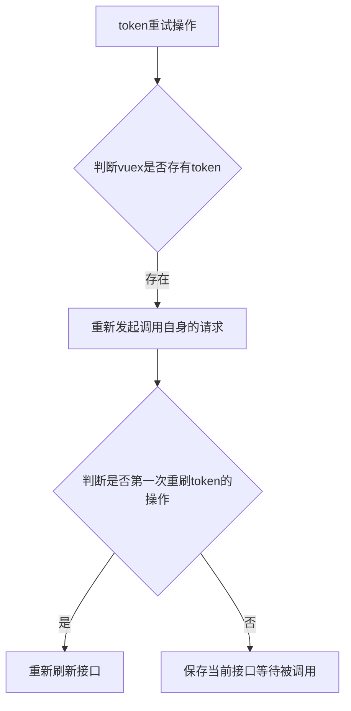

---
# 设置作者
author: caoguanjie
# 设置写作时间
date: 2021-07-14
---


# HTTP服务


## 前言
在前后端分离的项目中，我个人认为http协议是最重要的一环，它是前后端沟通的桥梁，也是数据动态化的唯一途径，所以每一个新框架搭建的时候，http服务的封装永远都是我花费最多心思的模块。本次ionic5的框架也不例外，ionic5 Vue版本，毫无疑问是采用它的老朋友`axios`,它是基于promise的http库，可运行在浏览器端和node.js中。他有很多优秀的特性，例如拦截请求和响应、取消请求、转换json、客户端防御XSRF等。所以我们的尤大大也是果断放弃了对其官方库vue-resource的维护，直接推荐我们使用axios库。如果还对axios不了解的，可以移步[axios文档](https://axios-http.com/zh/docs/intro)。

在这里我可能要多啰嗦几句，这次封装http给我的感触很大，因为我两年前用angular2+封装了http服务，通过对比发现这两者的区别很大，angular2+ 给应用提供了一个 HTTP 客户端 API，也就是 `@angular/common/http` 中的 `HttpClient` 服务类。它基于浏览器提供的 `XMLHttpRequest` 接口。 `HttpClient` 带来的其它优点包括：可测试性、强类型的请求和响应对象、发起请求与接收响应时的拦截器支持，以及更好的、基于可观察`（Observable）`对象的 API 以及流式错误处理机制。在最新angular的官方文档上， `HttpClient` 和 `Rxjs`结合越来越紧密了，如果还对Rxjs不了解的，可以移步[Rxjs文档](https://cn.rx.js.org/)

总结一下就是vue是axios库的`Promise`（承诺），angular2+是用`Observable`（可观察者对象）.


::: info 可观察对象(Observable) vs 承诺(Promise)
可观察对象经常拿来和承诺进行对比。有一些关键的不同点：

* 可观察对象是声明式的，在被订阅之前，它不会开始执行。承诺是在创建时就立即执行的。这让可观察对象可用于定义那些应该按需执行的菜谱。
* 可观察对象能提供多个值。承诺只提供一个。这让可观察对象可用于随着时间的推移获取多个值。
* 可观察对象会区分串联处理和订阅语句。承诺只有 `.then()` 语句。这让可观察对象可用于创建供系统的其它部分使用而不希望立即执行的复杂菜谱。
* 可观察对象的 `subscribe()` 会负责处理错误。承诺会把错误推送给它的子承诺。这让可观察对象可用于进行集中式、可预测的错误处理。
:::


##### 如果看成状态机
* Promise 具有 3 个状态：pending、resolved、rejected（如果 Cancelable Promise 正式通过，那么还会增加一个状态）。
* Observable 有 N + 3 个状态：idle、pending、resolved_0、resolved_1 … resolved_N、completed 和 error。

总结：相比于 Promise 这个有限状态机而言，Observable 既可能是有限状态机，也可能是无限状态机（N 为无穷）。

我个人用了promise和Observable两者之后，我简单的、粗略地发表一些意见，不一定百分百对，可以作为大家的一个参考思路，我认为Observable就想一个工作流，当用户执行`subscribe`订阅之后，数据被创建，到传输到`subscribe`接口这段时间之间，Observable可以用很多操作符号，例如`map()`、`do()`等等方式，对数据进行优雅的处理，然后返回用户想要的数据。就例如一头猪被宰了之后，放在屠宰场的工作台流水线上进行切割、分拣、清洗、包装之后，再拉到超市上贩卖的过程一样，`subscribe`方法拿到的数据，就是超市上售卖的成品猪肉。Observable可以干预流水线上所有流程，实现对数据的定制化。Promise就不能干预流水线上任何流程，它能做就是下单买猪肉，屠宰场做好的成品了，他拿到就是超市在售卖的成品猪肉。所以我在使用axios库的时候，对请求数据的处理和数据完成后的处理，只能在axios库中`interceptors`拦截器完成，但是angular2+就不用使用http的拦截器，一样很优雅处理各种数据，两者各有优劣。


## 项目需求
一个完整的HTTP服务要包括以下内容：

1. 能转化特殊字符，例如+，-，[]
2. 能识别浏览器的不同状态码,例如：5xx/4xx/3xx
3. 对请求服务进行拦截，处理get和post、put等不同类型的请求参数
4. 对捕获错误统一报错（包括请求超时，统一报错）
5. 在HTTP请求发起或者结束，开启或者关闭loading动画
6. 对请求成功返回的状态进行预处理
7. 对请求失败的异常信息进行预处理
8. 同一个页面多个请求只发起一个loading动画
9.  多次点击按钮，只能触发一次请求，能做到拦截重复请求，取消请求
10. 支持同步请求，主要作用于默默登录，登录完之后，用户无感知获取新token，不影响原来的接口返回参数
11. 接受请求超时或者http状态为5xx的时候，进行重试接口
12. 路由切换取消当前所有pending状态的请求,并且可配置白名单
13. 单独取消发出的某个请求，针对例如：文件上传比较久，然后想取消的。（尚未开发）

## 目录说明

```sh
......                        
├── src                                 
│   ├── utils                     # 工具类
│       ├── http                  # http服务
│           ├── axiosCancle.ts    # 拦截重复请求，取消请求
│           ├── axiosLoading.ts   # 显示loading界面和隐藏loading界面的逻辑
│           ├── axiosRetry.ts     # 重试接口的逻辑
│           ├── checkStatus.ts    # 主要针对一些http协议的状态码进行针对性的一些处理
│           ├── index.ts          # http服务的入口文件，初步定义了axios的一些基本属性
│           ├── interceptors.ts   # axios库的拦截器方法
│           └── types.ts          # 预定义的接口类型
......    
```

http服务存放在`/src/utils/http`目录底下，一共有7个文件，分别的功能如下：

* `axiosCancle.ts`文件主要解决了多次点击按钮，只能触发一次请求，能做到拦截重复请求，取消请求的功能
* `axiosLoading.ts`文件主要封装了 显示loading界面和隐藏loading界面的逻辑
* `axiosRetry.ts` 文件主要封装了当接口类型为get/put/delete,且请求超时或者状态码为5xx的时候，会发起两次重试接口的逻辑
* `checkStatus.ts` 文件主要针对一些http协议的状态码进行针对性的一些处理
* `index.ts` http服务的入口文件，初步定义了axios的一些基本属性，例如api地址，拦截器的方法等等
* `interceptors.ts` axios库的拦截器方法，包括请求拦截和响应拦截，上面所有文件，都是围绕着这个文件的逻辑处理进行，里面是http服务封装的核心内容。
* `types.ts` 在封装http服务过程中要定义一些接口类型，或者针对axios的已有接口类型进行接口拓展或者继承，都将在这个文件定义，可以说这个文件主要是定义或者声明变量接口的一个集中文件。


## 安装 axios

```shell
npm install axios; // 安装axios
```

## 基本框架

`index.ts`http服务的入口文件，初步定义了axios的一些基本属性，例如api地址，拦截器的方法等等


```ts
import axios, { AxiosInstance } from 'axios'
import { requestFail, requestSuccess, responseFail, responseSuccess } from './interceptors';

const service: AxiosInstance = axios.create({
  baseURL: fitsConfig.baseURL, // url = base url + request url
  timeout: fitsConfig.httpTimeOut,
  retries: 2,  // 重试的次数
  retryDelay: 2000, // 每一次重试，会延迟多少秒
})

// 请求拦截
service.interceptors.request.use(requestSuccess, requestFail)

// 响应拦截
service.interceptors.response.use(responseSuccess, responseFail)

export default service;
```

### http服务的调用方式
在`src/api/app.ts`放http的调用接口。
```ts
// 导入index文件中http模块
import http from "@/utils/http"

export const getUserInfo = () =>
  http({
    url: '/Common/User',
    method: 'get',
    params: {
      id: 1111,
      text: "ddd"
    },
    isLoading: true // 拓展的属性
  })
```

## http的接口类型

`types.ts` 在封装http服务过程中要定义一些接口类型，或者针对axios的已有接口类型进行接口拓展或者继承，都将在这个文件定义，可以说这个文件主要是定义或者声明变量接口的一个集中文件。

在这个文件中，你可以看到ts中关于接口类型的枚举、接口的拓展。

### 接口的扩展

```ts
// 拓展AxiosRequestConfig的接口，在他原来已有的基础上拓展更多的属性
declare module 'axios'{
    interface AxiosRequestConfig {
       // 是否显示loading界面
       isLoading?: boolean;
       // 是否显示提示信息
       isShowMessage?: boolean;
       // 成功的文本信息
       successMessageText?: string;
       // 是否显示成功信息
       isShowSuccessMessage?: boolean;
       // 是否显示失败信息
       isShowErrorMessage?: boolean;
       // 错误的文本信息
       errorMessageText?: string;
       // 旧的参数类型，默默登录，换token的时候，需要
       oldParams?: any;
       // 旧的URL，URL在请求拦截会被改变，默默登录，换token的时候，需要
       oldURL?: string | undefined;
       // 错误消息提示类型
       errorMessageMode?: 'alert' | 'toast';
       // 失败前重试的次数,默认是一次
       retries?: number; 
       // 控制重试请求之间延迟的回调。默认是2000毫秒，默认是1秒
       retryDelay?: number;
       // 当前重试的次数，或者说当前是第几次重试
       retryCount?: number;
    }
    interface AxiosResponse<T = any>{
        RetCode: number;
        Message: string;
        ReturnData: T;
    }
  }

```
::: danger 为什么要扩展AxiosRequestConfig?
:::


首先在vscode上，找到index.ts入口文件，点击关键字`axios`,按住Ctrl键，点击关键字，查看源码，如下：

```ts
export interface AxiosRequestConfig {
  url?: string;
  method?: Method;
  baseURL?: string;
  transformRequest?: AxiosTransformer | AxiosTransformer[];
  transformResponse?: AxiosTransformer | AxiosTransformer[];
  headers?: any;
  params?: any;
  paramsSerializer?: (params: any) => string;
  data?: any;
  timeout?: number;
  timeoutErrorMessage?: string;
  withCredentials?: boolean;
  adapter?: AxiosAdapter;
  auth?: AxiosBasicCredentials;
  responseType?: ResponseType;
  xsrfCookieName?: string;
  xsrfHeaderName?: string;
  onUploadProgress?: (progressEvent: any) => void;
  onDownloadProgress?: (progressEvent: any) => void;
  maxContentLength?: number;
  validateStatus?: ((status: number) => boolean) | null;
  maxBodyLength?: number;
  maxRedirects?: number;
  socketPath?: string | null;
  httpAgent?: any;
  httpsAgent?: any;
  proxy?: AxiosProxyConfig | false;
  cancelToken?: CancelToken;
  decompress?: boolean;
}
export interface AxiosInstance {
  (config: AxiosRequestConfig): AxiosPromise;
  (url: string, config?: AxiosRequestConfig): AxiosPromise;
  defaults: AxiosRequestConfig;
  interceptors: {
    request: AxiosInterceptorManager<AxiosRequestConfig>;
    response: AxiosInterceptorManager<AxiosResponse>;
  };
  getUri(config?: AxiosRequestConfig): string;
  request<T = any, R = AxiosResponse<T>> (config: AxiosRequestConfig): Promise<R>;
  get<T = any, R = AxiosResponse<T>>(url: string, config?: AxiosRequestConfig): Promise<R>;
  delete<T = any, R = AxiosResponse<T>>(url: string, config?: AxiosRequestConfig): Promise<R>;
  head<T = any, R = AxiosResponse<T>>(url: string, config?: AxiosRequestConfig): Promise<R>;
  options<T = any, R = AxiosResponse<T>>(url: string, config?: AxiosRequestConfig): Promise<R>;
  post<T = any, R = AxiosResponse<T>>(url: string, data?: any, config?: AxiosRequestConfig): Promise<R>;
  put<T = any, R = AxiosResponse<T>>(url: string, data?: any, config?: AxiosRequestConfig): Promise<R>;
  patch<T = any, R = AxiosResponse<T>>(url: string, data?: any, config?: AxiosRequestConfig): Promise<R>;
}

export interface AxiosStatic extends AxiosInstance {
  create(config?: AxiosRequestConfig): AxiosInstance;
  Cancel: CancelStatic;
  CancelToken: CancelTokenStatic;
  isCancel(value: any): boolean;
  all<T>(values: (T | Promise<T>)[]): Promise<T[]>;
  spread<T, R>(callback: (...args: T[]) => R): (array: T[]) => R;
  isAxiosError(payload: any): payload is AxiosError;
}

declare const axios: AxiosStatic;
```

我们看到源码可以发现，axios 实例化 `create`事件的出入参数接口类型都是： `AxiosRequestConfig`

然而源码中的属性是固定的，但是我们需要更多属性去配合我们做业务上的变化，例如是否控制loading的显示隐藏、是否需要打开提示框，定义重试的次数和延迟时间等等，这些属性都是源码没有的。基于这种原因，所以我们需要拓展更多属性，可能有人会问不拓展会发生什么？会产生什么问题？

如果不拓展接口属性，在ts项目中，因为没有发现这个属性，所以会报错，编译就会不通过，如果不是开启严格模式，在一般的js项目中，这种一般不会有问题，在js中，如果没有这个属性，会自动添加这个属性，在tslint的规则中，因为是强类型语言，所以不拓展属性，就会编译不通过

  


接口的拓展后，不仅能拥有原来的属性，还能自动合并你定义的属性，接口的拓展关键代码是

```ts
declare module 'axios'{
    interface AxiosRequestConfig {
        // 自定义属性
    }
}
```

我在其中还尝试过ts的接口继承，但是在实际开发过程发现不太合适，因为会改变接口类型的名字，以下是接口继承的范例:

```ts
import AxiosRequestConfig from axios
interface customAxiosRequestConfig extends AxiosRequestConfig {
        // 自定义属性
}
```
从上面代码可以看出来，定义的`customAxiosRequestConfig`接口是可以继承`AxiosRequestConfig`所有属性和自定义属性的，但是不符合我们的需求，如果我们用了`customAxiosRequestConfig`接口名字，就改变了源码中`AxiosRequestConfig`的接口名字，会导致源码中很多定义了这个名字的接口都要相应的修改，工程量太大，而且没必要，因为接口的拓展就已经很完美的解决问题了，不需要继承。


### ts中的枚举用法
```ts
/**
 * @description: 请求结果集
 */
export enum ResultEnum {
    SUCCESS = 1001, // 查询成功、操作成功  
    ERROR = 1002,   // 操作失败、查询失败  
    STYSTEM_ERROR = 2001, // 系统异常  
    LOGIN_FAIL = 2002,    // 登录身份验证失效
    DOUBLE_REQUEST = 2003, // 重复请求
    PARAMAR_ERROR = 2004,  // 参数不符合要求
    APPID_LOWER = 2005,  // APP版本过低
    APPID_ERROR = 2006,  // APPID无效、微信获取用户信息失败
    HOT_UNPDATE = 2007,  // 需要进行热更新检查
    USER_UNPDATE= 2008,  // 用户信息已变更		
    FORCE_OFFLINE=2009,  // 强制下线
}
```

## axios拦截器
打开`interceptors.ts`文件，可以看到请求拦截和响应拦截，基本框架如下：

```ts
// 请求拦截器
export const requestSuccess = (request: AxiosRequestConfig) => {
    // 判断当前请求是否设置了不显示Loading
    // 在请求发出去之前拦截请求参数，包括param和body，
    // get接口的数据，属性要用Data[id]=1111&Data[text]这个格式才能请求成功
    // post请求，需要把所有属性的数据包裹在Data{}里面
    return request;
};
// 请求失败拦截
export const requestFail = (error: AxiosRequestConfig) => {
    // 这里极少情况会进来，暂时没有找到主动触发的方法，估计只有浏览器不兼容时才会触发，欢迎后面同学补充
    // 看了几个GitHub的issue，有人甚至提出了这个方法是不必要的（因为没有触发的场景），不过还是建议大家按照官方的写法，避免不必要的错误
    // 进来之后没法发起请求
    return Promise.reject(error);
    // 用resolve会令这个请求的promise不会被中断，还是会把error返回到请求中的then的流程中
    // return Promise.resolve(error); 
};


/**
 * 响应成功拦截器
 * 只有返回的状态码是2xx，都会进来这里
 * 1. 返回data里面的数据，只保留公司接口规范的数据
 * 2. Axios 接口超时统一处理，请求超时的话，可以重新发起一次请求
 * 3. 针对公司自定义的各种状态码进行处理
 * 4. 能默默登录，换取新的token
 * 5. 能关闭loading界面
 * @param response 
 */
export const responseSuccess = (response: AxiosResponse) => {
    return response.data;
};

/**
 * @description 响应失败拦截器 统一处理http异常
 * @description 注意如果取消请求，一样走responseFail的流程
 */
export const responseFail = (error: AxiosError) => {
    // 1. http状态码非2开头的都会进来这里，如404,500等
    // 2. 取消请求也会进入这里，CancelToken，可以用axios.isCancel(err)来判断是取消的请求
    // 3. 请求运行有异常也会进入这里，如故意将headers写错：axios.defaults.headers = '123',或者在request中有语法或解析错误也会进入这里
    // 4. 这里会处理一些达到重连的条件的接口，进行重连。
    // 进入这里意味着请求失败，axios会进入catch分支
   
        return Promise.reject(error);
    }
};

```


## 如何取消重复请求
在开发中，经常会遇到接口重复请求导致的各种问题。

对于重复的get请求，会导致页面更新多次，发生页面抖动的现象，影响用户体验。

对于重复的post请求，会导致在服务端生成两次记录（例如运维组提交退件申请，一不小心就会在后台产生两条记录）。

本次http服务更新，提供以下问题的解决方案：
1. 路由切换的时候，取消当前所有接口处于pending状态的请求
2. 当用户多次点击按钮，对同一个接口同时发起多次请求的时候，保留第一次请求，中断后面多余的请求。

网上找了一些博主的方法，大部分都是拦截了前面的请求。比如说发了一个请求a, 在 a 还没有完成时，又发了一个与 a 一样的请求 a2 ,大部分的方法是取消了请求a只保留a2，以上方法在接口快的时候是不会有问题的。但是接口慢的时候，a接口都快要请求完成了，这时给它来了个取消，很浪费后端资源，就是第一个接口a后端已经差不多处理好数据，正准备返回的时候，前端突然中断它，然后再发起一个相同的接口a2，后端又要重新处理一遍，因此不太合理。

### axios 的 cancelToken
在axios官方文档上要取消一个正在发出或已发出但是还没有返回数据的请求，用到的是axios.CancelToken这个对像里面的方法，官方案例如下：

第一种方法：使用 CancelToken.source 工厂方法创建 cancel token，像这样：
```ts
const CancelToken = axios.CancelToken;
const source = CancelToken.source();

axios.get('/user/12345', {
  cancelToken: source.token
}).catch(function(thrown) {
  if (axios.isCancel(thrown)) {
    console.log('Request canceled', thrown.message);
  } else {
     // 处理错误
  }
});

axios.post('/user/12345', {
  name: 'new name'
}, {
  cancelToken: source.token
})

// 取消请求（message 参数是可选的）
source.cancel('Operation canceled by the user.');
```

 第二种方法： 通过传递一个 executor 函数到 CancelToken 的构造函数来创建 cancel token：

```ts
const CancelToken = axios.CancelToken;
let cancel;

axios.get('/user/12345', {
  cancelToken: new CancelToken(function executor(c) {
    // executor 函数接收一个 cancel 函数作为参数
    cancel = c;
  })
});

// cancel the request
cancel();
```
### 两种方法的区别与应用

第一种方法是多个请求共用一个token,适合在某一时间同时取消所有请求，第二种方法每个请求有独立的token,适合每个请求分情况是否进行单独取消。

根据我们的需求，很明显我们要采用第二种更加灵活。


### cancelToken的源码分析

为了让大家更加直观了解cancelToken是如何做到生成令牌，通过令牌是取消接口，我们对源码进行一波分析，让大家了解一下他的设计思想

先看官方的源码：
```js
//路径在： node_module/axios/lib/cancel/CancelToken.js

'use strict';

var Cancel = require('./Cancel');

function CancelToken(executor) {
    if (typeof executor !== 'function') {
        throw new TypeError('executor must be a function.');
    }
    /**
    * 定义一个将来能执行取消请求的promise对象，当这个promise的状态为完成时(fullfilled),
    * 就会触发取消请求的操作（执行then函数）。而执行resolve就能将promise的状态置为完成状态。
    * 这里把resolve赋值给resolvePromise，就是为了在这个promise外能执行resolve而改变这个promise的状态
    * 注意这个promise对象被赋值给CancelToken实例的属性promise，将来定义then函数就是通过这个属性得到promise
    */
    var resolvePromise;
    this.promise = new Promise(function promiseExecutor(resolve) {
        resolvePromise = resolve;
    });
    /**
    * 将CancelToken实例赋值给token
    * 执行executor函数，将cancel方法传入executor，
    * cancel方法可调用resolvePromise方法，即触发取消请求的操作
    */
    var token = this;
    executor(function cancel(message) {
        if (token.reason) {
            // 取消已响应 返回
            return;
        }
        token.reason = new Cancel(message);
        // 这里执行的就是promise的resolve方法，改变状态
        resolvePromise(token.reason);
  });
}

CancelToken.prototype.throwIfRequested = function throwIfRequested() {
    if (this.reason) {
        throw this.reason;
    }
};

// 这里可以看清楚source函数的真面目
CancelToken.source = function source() {
    var cancel;
    var token = new CancelToken(function executor(c) {
        // c 就是CancelToken中给executor传入的cancel方法
        cancel = c;
    });
    return {
        token: token,
        cancel: cancel
    };
};

module.exports = CancelToken;
```

`CancelToken`是一个构造函数，通过`new CancelToken()`得到的是一个实例对象，它只有一个属性`promise`, 它的值是一个能触发取消请求的Promise对象。

    token = new CancelToken(executor function) ===> { promise: Promise对象 }

执行CancelToken函数做了两件事：

1. 创建一个Promise对象，且将这个对象赋值给promise属性，其resolve参数被暴露出来以备cancel函数执行。这个就是点睛之笔，通过暴露resolve给全局变量，让promise触发时机，由外面的方法所控制。
2. 执行`executor`函数，将内部定义的`cancel`函数作为参数传递给`executor`

```ts
// 源码相当于：
var token = this;
var cancel = function (message) {
    if (token.reason) {
        // 取消动作已响应 返回
        return;
    }
    token.reason = new Cancel(message);
    // 这里执行的就是promise的resolve方法，改变状态
    resolvePromise(token.reason);
}
executor(cancel);
```

所以执行

```ts
let cancel
token = new CancelToken(function executor(c) {
    cancel = c;
});
```

因此得到结果是：
* token值为{promise: Promise对象}
* executor函数被执行，即cancel = c执行，因此变量cancel被赋值了，值就是CanelToken内部的那个cancel函数。


### CancelToken的实际应用
上面我们讲明白了原理，下面讲一下实际如何使用

::: tabs

@tab:active 添加Pending

```ts

/**
 * @description 添加请求，创建取消请求的令牌，把token和接口信息作为键值对保存到map
 * @param config 
 */
export const addPending = (config: AxiosRequestConfig) => {
  const url = getPendingUrl(config)
  if (!pendingMap.has(url)) {
    // 如果 pending 中不存在当前请求，则添加进去,
    config.cancelToken =
      config.cancelToken ||
      new axios.CancelToken((cancel) => {
        // 把第一个接口的token保存起来
        pendingMap.set(url, cancel)
      })
  } else {
    // 如何pending中存在当前请求，则马上取消当前请求，并移除，这种方式是取消第二次重复请求，保留第一次请求
    config.cancelToken = config.cancelToken || new axios.CancelToken((cancle: Canceler) => {
      cancle(`重复的请求被主动拦截:  method: ${config.method} --> ${config.url} --> ${qs.stringify(config.data)},${qs.stringify(config.params)}`);
    })
  }
}
```
@tab 取消重复接口

```ts
/**
 * @description 清除当前请求队列的数据。这个方法保留第一个请求，取消后面发起的请求
 * @param config 
 */
export const removePendingMap = (config: AxiosRequestConfig) => {
  config.data = typeof config.data === 'string' ? JSON.parse(config.data) : config.data
  const url = getPendingUrl(config);
  pendingMap.delete(url)
}

```

上面的和下面的代码有何区别呢？？？

上面的代码为了是保留第一个接口，取消后面新增的重复接口

下面的代码主要是取消前面重复的接口，保留后面最后一次的接口。

主要要选用那种方法，取决于`添加pending`的方法如何实现。


```ts
/**
 * cancel这里调用有个问题,就是如果你在response的响应体
 * @description  移除请求，这个方法是同时多个重复接口，清除前面多余接口，保留最后一次请求
 * @param {CustomAxiosRequestConfig} config 
 */
export const removePending = (config: AxiosRequestConfig) => {
  const url = getPendingUrl(config);
  if (pendingMap.has(url)) {
    // 如果在 pending 中存在当前请求标识，需要取消当前请求，并且移除
    const cancel = pendingMap.get(url);
    // js的短路运算
    console.log(cancel)
    // cancel && cancel(`重复的请求被主动拦截:  method: ${config.method} --> ${config.url} --> ${qs.stringify(config.data)},${qs.stringify(config.params)}`);
    pendingMap.delete(url)
  }
}
```
@tab 取消所有接口

```ts
/**
 * 用于可以在页面上一次性取消所有接口的请求
 * @description: 清空所有pending
 */
export const removeAllPending = () => {
  pendingMap.forEach((cancel) => {
    cancel && isFunction(cancel) && cancel('清除多个重复请求')
  })
  pendingMap.clear()
}
```

这里的方法主要的作用是，放在路由守卫的方法调用里面，针对路由的改变，取消上一个页面没有完成的所有接口


```ts
// 路径：src/router/routeGuard.ts

import { removeAllPending } from "@/utils/http/axiosCancle";
import { Router } from "vue-router";

/**
 * @description 创建路由守卫
 * @param router 
 */
export const createRouterGuards = (router: Router) => {
    router.beforeEach((to, from, next) => {
        removeAllPending();
        next()
    })
}
```
:::


上面重要的知识点是：es6语法中的Map的方法的具体使用。有兴趣的同学，百度查一下具体用法。


## loading的显示和隐藏

### 代码说明

1. 基本原理是通过 axios 提供的请求拦截和响应拦截的接口，控制 loading 的显示或者隐藏。
2. loding 效果这里采用的是 ionic 中提供的 loadingController 组件来实现
3. 内部有个计数器，确保同一时刻如果有多个请求的话，不会同时出现多个 loading，而是只有 1 个。并且在所有请求结束后才会隐藏 loading。
4. 使用了 lodash 的 debounce 防抖。因为有时会碰到在一次请求完毕后又立刻又发起一个新的请求的情况（比如删除一个表格条目后立刻进行刷新）。这种情况会造成连续 loading 两次，并且中间有一次极短的闪烁。通过防抖可以让 300ms 间隔内的 loading 便合并为一次，避免闪烁的情况。
5. 默认所有请求都会自动有 loading 效果。如果某个请求不需要 loading 效果，可以在请求参数AxiosRequestConfig中设置isLoading设置为false


::: tabs

@tab:active 显示loading


```ts

// 保存定时器，以便方便取消
let timer: any;
//当前正在请求的数量
let currentLoadingRequestCount = 0;

/**
 * @description 显示loading界面
 * 请求如果超过300ms，就会发起loading，如果低于300ms，不会产生loading界面
 */
export const showLoading = () => {
    if (!timer) {
        timer = setTimeout(function () {
            // loadObject = new LoadingService();
            loadObject.present()
        }, 300)
    }
    currentLoadingRequestCount++;
}
```

@tab 隐藏loading

```ts
/**
 * @description 隐藏loading的界面
 */
export const hideLoading = () => {
    currentLoadingRequestCount--;
    // 防止出现负数，最低是0；
    currentLoadingRequestCount = Math.max(currentLoadingRequestCount, 0);
    if (currentLoadingRequestCount === 0) {
        // 不管300ms是否达到，取消抖动的定时器。
        timer && clearTimeout(timer);
        timer = null;
        // 关闭弹窗，防抖：将 300ms 间隔内的关闭 loading 便合并为一次。防止连续请求时， loading闪烁的问题。
        _.debounce(() => {
            loadObject && loadObject.dismiss();
            // loadObject = null;
        }, 300)();
        
    }
}
```
:::


## 如何重试请求

这里主要封装关于http出现网络错误或幂等请求（GET、HEAD、OPTIONS、PUT 或 DELETE）上的 5xx 错误，http请求将会重连的操作

这里设计了一个http的概念：[幂等请求](https://www.zuimoban.com/php/other/7171_2.html)


针对是否达到重试的条件，我做了以下判断


::: tabs

@tab:active 判断网络状态

这里涉及了一个新的库，`is-retry-allowed`检查是否请求可以基于重试error.code
```ts
import isRetryAllowed from 'is-retry-allowed';
export const isNetworkError = (error: any) =>  {
    console.log(error.config)
    return (
        !error.response &&
        Boolean(error.code) && // 防止重试已取消的请求
        isRetryAllowed(error)
    ); // 防止重试不安全的错误
}
```
@tab 判断状态码


```ts
/**
* @param  {Error}  error
* @return {boolean}
*/
export const isRetryableError = (error: any) => {
    return (
        (!error.response || (error.response.status >= 500 && error.response.status <= 599))
    );
}
```

@tab 判断请求类型


```ts
const SAFE_HTTP_METHODS = ['get', 'head', 'options'];
const IDEMPOTENT_HTTP_METHODS = SAFE_HTTP_METHODS.concat(['put', 'delete']);
/**
 * @param  {Error}  error
 * @return {boolean}
 */
export const isIdempotentRequestError = (error: any) => {
    if (!error.config) {
        // 无法确定是否可以重试请求
        return false;
    }

    return isRetryableError(error) && IDEMPOTENT_HTTP_METHODS.indexOf(error.config.method) !== -1;
}
```
:::


### 核心实现

```ts
/**
 * @description 响应失败拦截器 统一处理http异常
 * @param error CustomAxiosError 自定义类型
 * @returns 
 * @description 注意如果取消请求，一样走responseFail的流程
 */
export const responseFail = (error: AxiosError) => {

  // more something code

  // 以下是重试逻辑
    if(!error.config || !error.config.retries) {
        return Promise.reject(error);
    }else{
        const {config} = error;
        config.retryCount = config.retryCount || 0;
        const shouldRetry = isNetworkOrIdempotentRequestErrors(error) && config.retryCount  < (config.retries as any);
       
        if(shouldRetry){
            config.retryCount += 1;
            return new Promise(resolve => setTimeout(() => {
                config.url = config.oldURL;
                config.params = config.oldParams;
                return resolve(http(config))
            }, config.retryDelay || 1000));
        }
        return Promise.reject(error);
    }
}


```

## 刷新token

项目一直存在一个需求：前端登录后，后端返回token，当接口返回token过期时，要求用登录接口，默默登录，获取新的token，前端需要做到无痛刷新token，即请求刷新token时要做到用户无感知。

### 实现思路

拦截接口返回后的数据。检查如果是token过期的状态码，先发起登录请求，获取接口返回的新token，保存到本地，再进行所有接口的重试。

### 代码实现
后端接口一般会有一个约定好的数据结构，如：

```js
{RetCode: 2002, Message: 'token过期', ReturnData: {}}
```

如我这里，后端约定当{RetCode === 2002时表示token过期了，此时就要求刷新token。我主要使用的响应拦截

```ts

/**
 * @description: 请求结果集
 */
export enum ResultEnum {
    SUCCESS = 1001, // 查询成功、操作成功  
    ERROR = 1002,   // 操作失败、查询失败  
    STYSTEM_ERROR = 2001, // 系统异常  
    LOGIN_FAIL = 2002,    // 登录身份验证失效
    DOUBLE_REQUEST = 2003, // 重复请求
    PARAMAR_ERROR = 2004,  // 参数不符合要求
    APPID_LOWER = 2005,  // APP版本过低
    APPID_ERROR = 2006,  // APPID无效、微信获取用户信息失败
    HOT_UNPDATE = 2007,  // 需要进行热更新检查
    USER_UNPDATE= 2008,  // 用户信息已变更		
    FORCE_OFFLINE=2009,  // 强制下线
}
// 属性token的方法
export const refreshToken = (response: AxiosResponse) => {
    return login({ LoginID: 'caogj', Password: '1111111' }).then((res: AxiosResponse) => {
        // 重新请求
        const { RetCode, ReturnData } = res;
        if (RetCode === ResultEnum.SUCCESS) {
            store.commit('app/setToken', ReturnData.LoginToken)
            const config = response.config
            // 由于requestSuccess拦截器里面对URL进行了改造，所以这里把最原始的URL转化出来
            config.url = config.oldURL;
            config.params = config.oldParams;
            // 最先的接口返回2002，也是最先返回正式的结果，剩余的接口再按顺序返回
            return http(config)
        } else {
            //刷新token失败，神仙也救不了了，跳转到首页重新登录吧
        }
    }).catch((err: any) => {
        console.error('refreshtoken error =>', err)
        //刷新token失败，神仙也救不了了，跳转到首页重新登录吧 
    })
}
/**
 * 响应成功拦截器
 * 只有返回的状态码是2xx，都会进来这里
 * 1. 返回data里面的数据，只保留公司接口规范的数据
 * 2. Axios 接口超时统一处理，请求超时的话，可以重新发起一次请求
 * 3. 误触按钮导致重复请求可以被取消
 * @param response 
 * @returns 
 */
export const responseSuccess = (response: AxiosResponse) => {
    console.error(response)
    response.config && removePendingMap(response.config)
    response.config && response.config.isLoading !== false  && hideLoading();// 关闭loading
    const { data } = response;
    const { RetCode, Message, ReturnData } = data;
    switch (RetCode) {
        case ResultEnum.SUCCESS:
            // 请求成功
            break;
        case ResultEnum.ERROR:
            // 请求失败
            break;
        case ResultEnum.STYSTEM_ERROR:
            // 系统异常
            break;
        case ResultEnum.LOGIN_FAIL: // 这里理解为2002
            // 登录失败
           return refreshToken(response)
        }

        // 更多状态，请参照枚举ResultEnum类型，进行业务处理
    }
    console.log(response)
    
    return response.data;
};
```
这里要注意几件事：
* 真实项目中请求登录的账号密码`{ LoginID: 'caogj', Password: '1111111' }`会由store全局调用。
* 由于requestSuccess拦截器里面对URL进行了改造，所以这里把最原始的URL转化出来，我们再发起请求的时候，要把URL和params重新转化一下。

 以上就基本做到了无痛刷新token，当token正常时，正常返回，当token已过期，则axios内部进行一次刷新token和重试。对调用者来说，axios内部的刷新token是一个黑盒，是无感知的，因此需求已经做到了。

### 发现问题
上面的代码还是存在一些问题的，没有考虑到多次请求的问题，因此需要进一步优化。

#### 如何防止多次刷新token

如果refreshToken接口还没返回，此时再有一个过期的请求进来，上面的代码就会再一次执行refreshToken，这就会导致多次执行刷新token的接口，因此需要防止这个问题。我们可以在request.js中用一个变量isRefreshing来标记当前是否正在刷新token的状态，如果正在刷新则不再调用刷新token的接口。

```ts
// 是否正在刷新的标记
let isRefreshing = false
export const responseSuccess = (response: AxiosResponse) => {
    ...
    switch (RetCode) {
        case ResultEnum.SUCCESS:
            // 请求成功
            break;
        case ResultEnum.ERROR:
            // 请求失败
            break;
        case ResultEnum.STYSTEM_ERROR:
            // 系统异常
            break;
        case ResultEnum.LOGIN_FAIL: // 这里理解为2002
            // 登录失败
            if (!isRefreshing) {
                isRefreshing = true;
                return refreshToken(response)
            } 
        }

        // 更多状态，请参照枚举ResultEnum类型，进行业务处理
    }
    console.log(response)
    
    return response.data;
};
```
这样子就可以避免在刷新token时再进入方法了。但是这种做法是相当于把其他失败的接口给舍弃了，假如同时发起两个请求，且几乎同时返回，第一个请求肯定是进入了refreshToken后再重试，而第二个请求则被丢弃了，仍是返回失败，所以接下来还得解决其他接口的重试问题。

### 同时发起两个或以上的请求时，其他接口如何重试
两个接口几乎同时发起和返回，第一个接口会进入刷新token后重试的流程，而第二个接口需要先存起来，然后等刷新token后再重试。同样，如果同时发起三个请求，此时需要缓存后两个接口，等刷新token后再重试。由于接口都是异步的，处理起来会有点麻烦。

当第二个过期的请求进来，token正在刷新，我们先将这个请求存到一个数组队列中，想办法让这个请求处于等待中，一直等到刷新token后再逐个重试清空请求队列。
那么如何做到让这个请求处于等待中呢？为了解决这个问题，我们得借助Promise。将请求存进队列中后，同时返回一个Promise，让这个Promise一直处于Pending状态（即不调用resolve），此时这个请求就会一直等啊等，只要我们不执行resolve，这个请求就会一直在等待。当刷新请求的接口返回来后，我们再调用resolve，逐个重试。最终代码：

```ts
// 是否正在刷新的标记
let isRefreshing = false
// 重试队列，每一项将是一个待执行的函数形式
let requestQueues: (() => void)[] = []
export const refreshToken = (response: AxiosResponse) => {
    return login({ LoginID: 'caogj', Password: '1111111' }).then((res: AxiosResponse) => {
        // 重新请求
        const { RetCode, ReturnData } = res;
        if (RetCode === ResultEnum.SUCCESS) {
            ... // something
            // 最先的接口返回2002，也是最先返回正式的结果，剩余的接口再按顺序返回
            // 已经刷新了token，将所有队列中的请求进行重试
            if(requestQueues && requestQueues.length){
                requestQueues.forEach(callback => callback())
                requestQueues = [];
            }
            isRefreshing = false;
            return http(config)
        } else {
            //刷新token失败，神仙也救不了了，跳转到首页重新登录吧
        }
    }).catch((err: any) => {
        console.error('refreshtoken error =>', err)
        //刷新token失败，神仙也救不了了，跳转到首页重新登录吧 
    })
}
export const responseSuccess = (response: AxiosResponse) => {
    ...
    switch (RetCode) {
        case ResultEnum.SUCCESS:
            // 请求成功
            break;
        case ResultEnum.ERROR:
            // 请求失败
            break;
        case ResultEnum.STYSTEM_ERROR:
            // 系统异常
            break;
        case ResultEnum.LOGIN_FAIL: // 这里理解为2002
            // 登录失败
            if (!isRefreshing) {
                isRefreshing = true;
                return refreshToken(response)
            } else {
                // 当遇到正在默默登录的接口，返回一个未执行resolve的promise
                return new Promise((resolve) => {
                    // 将resolve放进队列，用一个函数形式来保存，等token刷新后直接执行
                    requestQueues.push(() => {
                        resolve(http(response.config))
                    })
                })
            } 
        }

        // 更多状态，请参照枚举ResultEnum类型，进行业务处理
    }
    console.log(response)
    
    return response.data;
};
```
这里可能比较难理解的是requests这个队列中保存的是一个函数，这是为了让resolve不执行，先存起来，等刷新token后更方便调用这个函数使得resolve执行。这个设计思想跟axios中的取消请求的令牌cancelToken是一样的，大家可以看回前面的源码分析。


###  不同时间差发起两个或以上的请求时，其他接口如何重试

这里的意思是当页面有两个接口a和b接口，a接口发起了token刷新重试操作，当token接口没有及时返回token的时候，b接口马上就发起了，这个时候token还没有回来，这样会导致了a和b接口都执行了一次刷新token的操作，这样会引发一系列的问题，例如第一次换取的token会被第二次token覆盖，或者第一次是通过授权码换取的token，第二次授权码失效了导致了b接口的失败。

针对以上的情况，我们调整以下步骤




最终代码：

```ts
// 重置请求参数
const resetRequestParams = (config: AxiosRequestConfig) => {
    config.url = config.oldURL
    config.params = config.oldParams
    return config
}
export const responseSuccess = (response: AxiosResponse) => {
    ...
    switch (RetCode) {
        case ResultEnum.SUCCESS:
            // 请求成功
            break;
        case ResultEnum.ERROR:
            // 请求失败
            break;
        case ResultEnum.STYSTEM_ERROR:
            // 系统异常
            break;
        case ResultEnum.LOGIN_FAIL: // 这里理解为2002
            // 登录失败
       if (!UserModule.token) {
              if (!isRefreshing) {
                  isRefreshing = true;
                  return refreshToken(response)
              } else {
                  // 当遇到正在默默登录的接口，返回一个未执行resolve的promise
                  return new Promise((resolve) => {
                      // 将resolve放进队列，用一个函数形式来保存，等token刷新后直接执行
                      requestQueues.push(() => {
                          resolve(http(resetRequestParams(response.config)))
                      })
                  })
              } 
         }else {
         	// 当由于接口快慢问题，会导致授权接口还没有返回token的时候，然后又发起了新一个请求，
          // 新请求因为没有token，又会直接报2002，导致又需要去请求一次授权，有时候会覆盖token或者引发其他问题。
                return http(resetRequestParams(response.config))
         }
        }

        // 更多状态，请参照枚举ResultEnum类型，进行业务处理
    }
    console.log(response)
    
    return response.data;
};
```


## 转换请求参数
转换参数的逻辑，是放在请求之前的拦截器里面：requestSuccess
```ts
// 请求拦截器
export const requestSuccess = (request: AxiosRequestConfig) => {
    // 判断当前请求是否设置了不显示Loading
    request.isLoading !== false  && showLoading();
    const _params = {
        token: store.state.app.token,
        AppID: store.state.app.AppID,
        sourceType: store.state.app.platform
    }
    // 默默登录时候，需要这两个参数
    request.oldParams = request.params;
    request.oldURL = request.url;
    if ((request.method as any).toLocaleUpperCase() === 'GET' && request.params) {
        // fits get接口的数据，属性要用Data[id]=1111&Data[text]这个格式才能请求成功
        let url: any = request.url;
        url += '?';
        const keys = Object.keys(request.params);
        for (const key of keys) {
            url += `${encodeURIComponent('Data[' + key + ']')}=${encodeURIComponent(request.params[key])}&`
        }
        request.url = url.substring(0, url.length - 1);
        request.params = {};
    } else {
        // 公司的接口post的数据要包裹在 Data对象里面。

       // 为了解决重试几次接口之后，Data对象不断被重复包裹，所以要加一层判断，如果一旦存在之后，不在再包裹一层
       if (!(request.data && request.data.Data)) {
            const _data = { Data: request.data }
            request.data = _data
        }
    }
    // console.log(request)
    // 将token、APPid等信息合并到原来params上面
    request.params = _params
    addPending(request);
    return request;
};
```
关键代码:
```js
  url += `${encodeURIComponent('Data[' + key + ']')}=${encodeURIComponent(request.params[key])}&`  
```
为什么要组装get的参数，是因为公司要求get的参数要被Data[]包住。这样拼接成URL转换，放到URL的属性上面，在浏览器上的network上能看到没有转义的中括号的参数。如果直接放到Parman里面，则会在谷歌上看到转义后的乱码参数
  


## 参考资料
1. [Angular与Rxjs学习](https://zhuanlan.zhihu.com/p/133739952)
2. [axios如何利用promise无痛刷新token](https://segmentfault.com/a/1190000020210980)
3. [axios拦截重复请求](https://segmentfault.com/a/1190000023073514)
4. [一套全面又有实际意义的axios封装+api管理方案](https://segmentfault.com/a/1190000027078266)